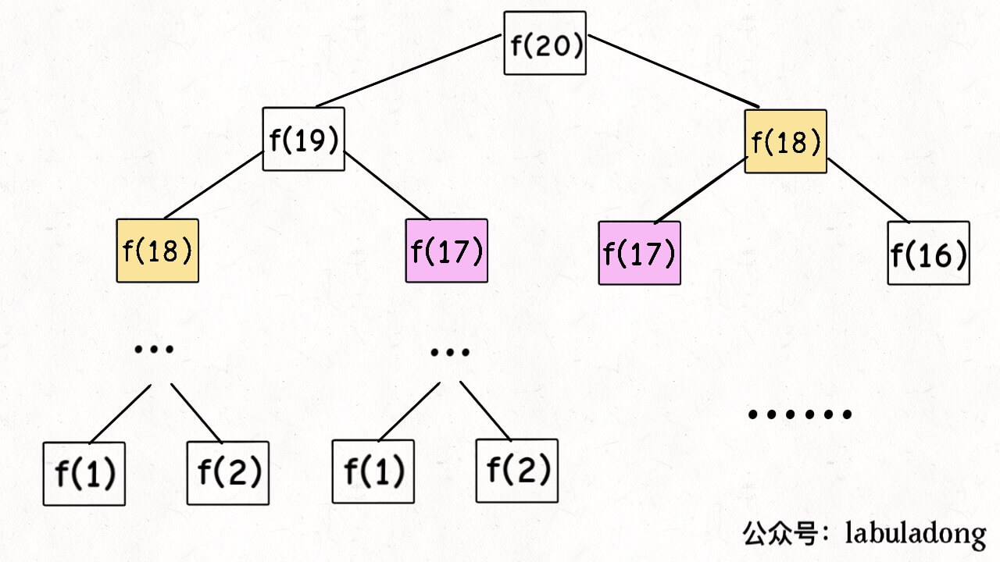
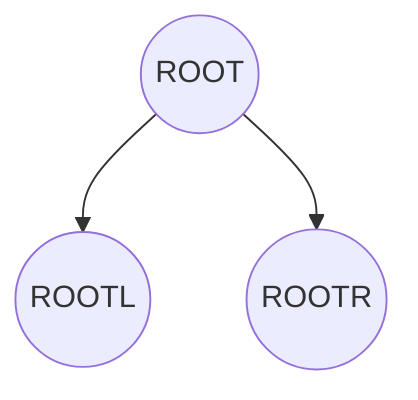
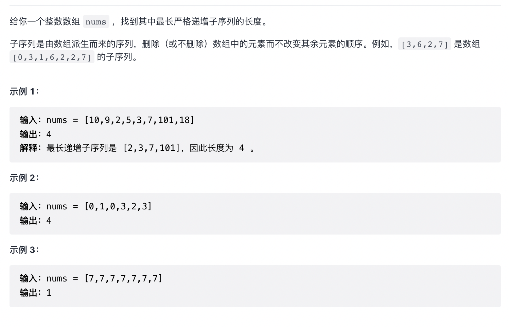
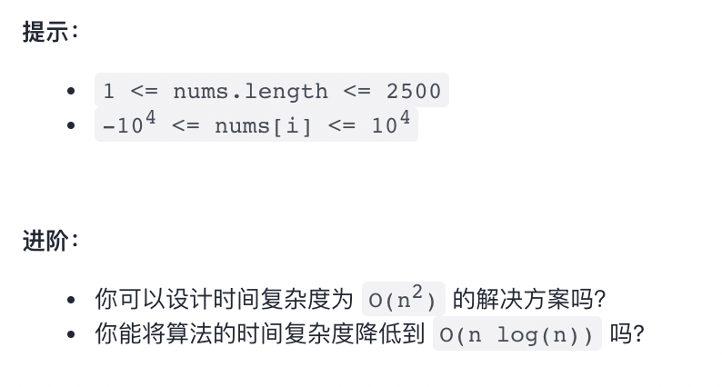

# 动态规划特点
1. 重叠子问题
2. 状态转移方程【最重要】
3. 最优子结构

题型：求最值
核心：穷举

解题套路
1. 明确【状态】
2. 明确【选择】
3. 明确dp函数/数组的定义
4. 明确 base case


**递归算法实践复杂度的计算**

递归函数调用的次数 * 递归函数本身的复杂度

递归的次数大概是一个树形的结构，需要掌握二叉树的节点统计公式

# 动态规划经典例题

## 斐波那契数列

> 指的是这样一个数列：1、1、2、3、5、8、13、21、34、……在数学上，斐波那契数列以如下被以递推的方法定义：F(0)=1，F(1)=1, F(n)=F(n - 1)+F(n - 2)（n ≥ 2，n ∈ N*）



上面的二叉树时间复杂度计算： 二叉树节点数量 `2^n - 1` * fib 函数时间复杂度。
时间复杂度很高。

通过观察发现，有很多节点是相同的。 f(17)... 
对于这些相同的节点，实际上是可以缓存下来的。使用带备忘录的递归算法，时间复杂度可以优化到 `O(n)`

但凡遇到地柜的地方最好都画出递归树，方便分析算法的复杂度，寻找算法低效的原因有巨大的帮助

### 状态转移方程理解

比如在 Fibonaci 这道题中， n 代表一种状态，这个状态是由 `n - 1` 和 `n - 2` 两种状态转移而来。

**动态规划最难的就是写出状态转移方程，剩余的优化，就是是否使用 缓存备忘录而已，再无奥妙可言**


### 再优化：状态压缩

- 暴力递归，存在很多重复计算
- 缓存备忘录
- 状态压缩

状态压缩，是一种优化空间复杂度的方式，这根据状态转移方程推导而来。

由状态转移方程： `fib(n) = fib(n - 1) + fib(n - 2)` 可知，实际上我们在缓存备忘录的时候，只需要在缓存中存储 `n - 1` 和 `n - 2` 

这就懒得自己写了，直接使用其他人的代码

```java
int fib(int n) {
    if (n == 2 || n == 1) 
        return 1;
    int prev = 1, curr = 1;
    for (int i = 3; i <= n; i++) {
        int sum = prev + curr;
        prev = curr;
        curr = sum;
    }
    return curr;
}
```

## 凑零钱问题

上面的斐波那契问题，涉及到了动态规划的两个要点：状态转移方程 与 重叠子问题的优化问题。

这道凑零钱的问题，讲解的是**最优子结构**的问题。

> 给你 k 种面值的硬币，面值分别为 c1, c2 ... ck，每种硬币的数量无限，再给一个总金额 amount，问你最少需要几枚硬币凑出这个金额，如果不可能凑出，算法返回 -1 。算法的函数签名如下：
> ```javascript
> // coins 中是可选硬币面值，amount 是目标金额
> int coinChange(int[] coins, int amount);
> ```

最优子结构问题，要求子问题之间需要相互独立。 这个问题中，每个硬币的选择不会制约其他硬币的选择。如果条件设置为，只能选择3枚硬币达成条件。那么，面值为5的硬币选择数量会制约其他面值的硬币数量选择。最优子结构被破坏。

> 比如说，假设你考试，每门科目的成绩都是互相独立的。你的原问题是考出最高的总成绩，那么你的子问题就是要把语文考到最高，数学考到最高…… 为了每门课考到最高，你要把每门课相应的选择题分数拿到最高，填空题分数拿到最高…… 当然，最终就是你每门课都是满分，这就是最高的总成绩。
> 
> 得到了正确的结果：最高的总成绩就是总分。因为这个过程符合最优子结构，“每门科目考到最高”这些子问题是互相独立，互不干扰的。
> 
> 但是，如果加一个条件：你的语文成绩和数学成绩会互相制约，数学分数高，语文分数就会降低，反之亦然。这样的话，显然你能考到的最高总成绩就达不到总分了，按刚才那个思路就会得到错误的结果。因为子问题并不独立，语文数学成绩无法同时最优，所以最优子结构被破坏。

这一道题满足了 “最优子结构” 的要求，判断属于动态规划的问题，可以使用 labuladong 的解题套路先分析一波

1. 确定 base case：目标金额为 0 时，返回 0；
2. 确定状态：也就是原问题和子问题中会变化的变量。由于硬币数量无限，硬币的面额也是题目给定的，只有目标金额会不断向 base case 靠近，所以唯一的 【状态】 就是目标金额 account。
3. 确定选择：也就是导致状态发生变化的行为。目标金额为什么会变化？在选择了一个硬币的时候，目标金额要减去选中的硬币面值。所以，所有硬币的面值就是你的 【选择】。 **状态的变化是要趋近于 base case 的。**
4. 明确 db函数/数组的约定。我们讲的是自顶向下的解法，所以会有一个递归的 `dp` 函数，一般来说，函数的参数就是状态转移中会变化的量，也就是上面说到的状态。函数的返回值就是题目要求我们计算的量。就本题来说，状态只有一个，即「目标金额」，题目要求我们计算凑出目标金额所需的最少硬币数量。所以我们可以这样定义 dp 函数： **dp(n) 的定义：输入一个目标金额 n，返回凑出目标金额 n 的最少硬币数量。**

```java
def coinChange(coins: List[int], amount: int):

    # 定义：要凑出金额 n，至少要 dp(n) 个硬币
    def dp(n):
        # 做选择，选择需要硬币最少的那个结果
        for coin in coins:
            res = min(res, 1 + dp(n - coin))
        return res

    # 题目要求的最终结果是 dp(amount)
    return dp(amount)
```
上面是 labuladong 的伪代码，说实话，并不能完全看懂

```javascript
function getMinCoinCount(coins: number[], account: number) {
    
    // 定义：利用 coins 组合成 n 的最小数量
    function dp(n) {
        if (n === 0) return 0
        let res = 0;
        // 遍历所有
        for (let coin in coins) {
            res = min(n, 1 + dp(n - coin))
        }
        return res
    }
    return dp(account)
}
```

### 优化

类似斐波那契，这样也是可以进行备忘录缓存优化的。 可以尝试画出二叉树分析。





# 最优子结构

- 这并不是动态规划问题专有的问题。很多问题其实都具有最优子结构，只是大部分不具有重叠子问题，所以我们不把他们归为动态规划系列问题。

最优子结构：可以从子问题的最优结果推出更大规模问题的最优结果。

最优子结构性质作为动态规划问题的必要条件，一定是要求最值的。

动态规划就是从最简单的 base case 向后推到，可以想象成一个链式反应，以小搏大。但只有最符合最优子结构的问题，才有发生这种链式反应的性质。

寻找最优子结构的过程，其实就是证明状态转移方程正确性的过程，方程符合最优子结构就可以写暴力解了。
写出暴力解之后通过用于分析的二叉树就可以知道有无重叠子问题，有则优化（备忘录和状态压缩）。


# 动态规划设计：最长递增子序列

[https://leetcode-cn.com/problems/longest-increasing-subsequence/](https://leetcode-cn.com/problems/longest-increasing-subsequence/)





## 自行分析
---

**套路分析**

1. 确定 `base case` 。 nums === [] 的时候 返回 0
2. 确定状态：nums
   1. 状态就是问题中会发生变化的变量
   2. 状态需要不断接近 base case
3. 确定选择
   1. 如何让状态不断接近 base case
4. 明确 db 函数/数组的约定
   1. 获取 nums 最长递增数组

---

尝试书写伪代码

```javascript
function getResult(arr) {

    function dp(nums) {
        if (nums.length === 0) return [];
        const cache = dp(arr.slice(0, -1));
        const lastNum = arr.pop();
        if (cache[cache.length - 1] < lastNum) {
            cache.push(lastNum);
        }
        return cache;
    }

    return dp(nums).length

}

```

尝试在 leetcode 中进行提交。

---

leetcode 中提交的代码报错了，并且发现自己的状态转移方程其实并没有写好，base case 也有缺漏

1. base case ：
   - nums.length === 0 时， return nums
   - nums.length === 1 时，return nums


```javascript
var lengthOfLIS = function(nums) {
    function dp(arr) {
        if (arr.length === 0) return [];
        else if (arr.length === 1) return arr;
        const cache = dp(arr.slice(0, -1));
        const lastNum = arr.pop();
        if (cache[cache.length - 1] < lastNum) {
            cache.push(lastNum);
        }
        return cache.length;
    }

    return dp(nums)
};

```

**逻辑错误：** 不能使用数组最后一项来判断 下一项是否能够直接添加到 d(n-1) 后面

这个错误应当是在 “状态转移方程” 这一步错误。

---

## labuladong


# 动态规划例题：零钱兑换 322

> 给你一个整数数组 coins ，表示不同面额的硬币；以及一个整数 amount ，表示总金额。
计算并返回可以凑成总金额所需的 最少的硬币个数 。如果没有任何一种硬币组合能组成总金额，返回 -1 。
你可以认为每种硬币的数量是无限的。

> `var coinChange = function(coins, amount) {}`

 
1. 确定 `base case` 。 amount = 0， return 0
2. 确定状态：amount
   1. 状态就是问题中会发生变化的变量
   2. 状态需要不断接近 base case
3. 确定选择 amount --
   1. 如何让状态不断接近 base case
4. 明确 db 函数/数组的约定: 指定 amount 获取凑出金额为 M(n) 的最少硬币数量
5. 状态转移方程
    Fib(n) = Min(Fib(n - coin(0)), Fib(n - coin(1))...) + 1

```javascript
    fib(amount) {
        if (amount == 0) return 0;
        let minCoinNum;
        for (let i = 0; i < coins.length; i++) {
            // 剩下的 要凑的数量
            const lastAmount = amount - coins[i];
            if (i === 0) minCoinNum = fib(lastAmount);
            else {
                minCounNum = Math.min(minCoinNum, fib(lastAmount));
            }
        }
        return minCoinNum + 1;
    }

```